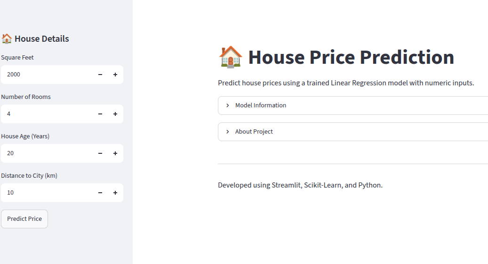
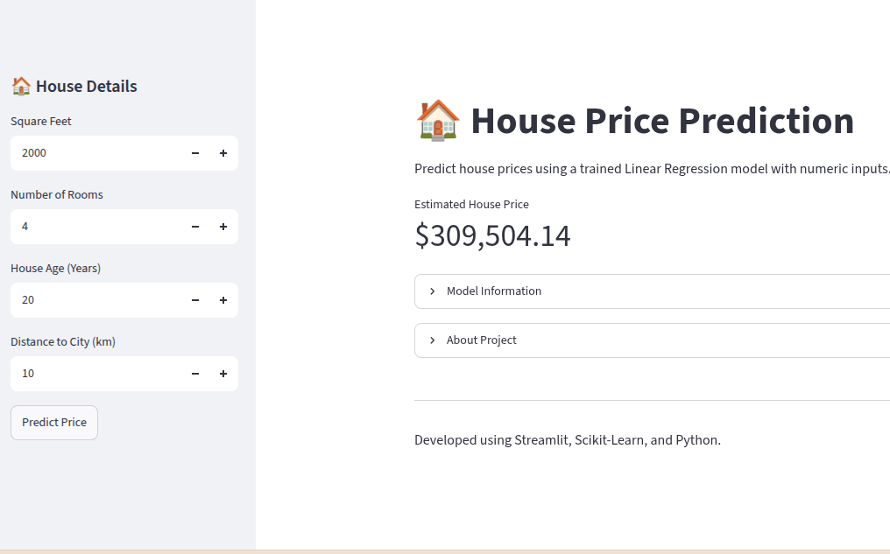
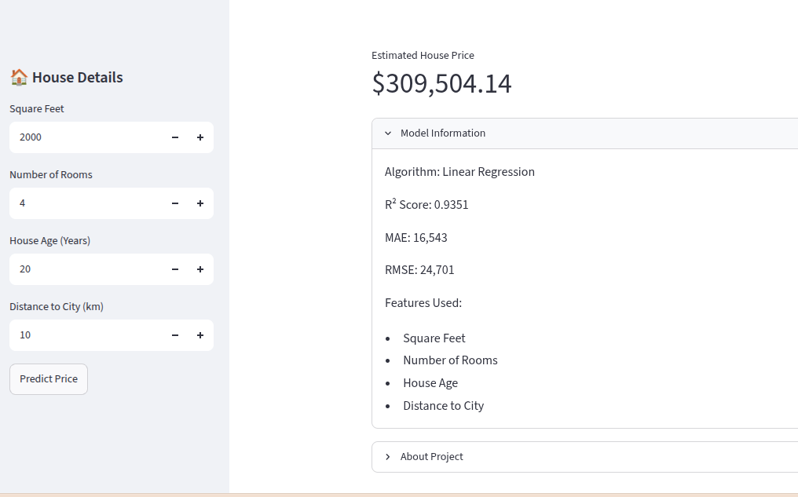
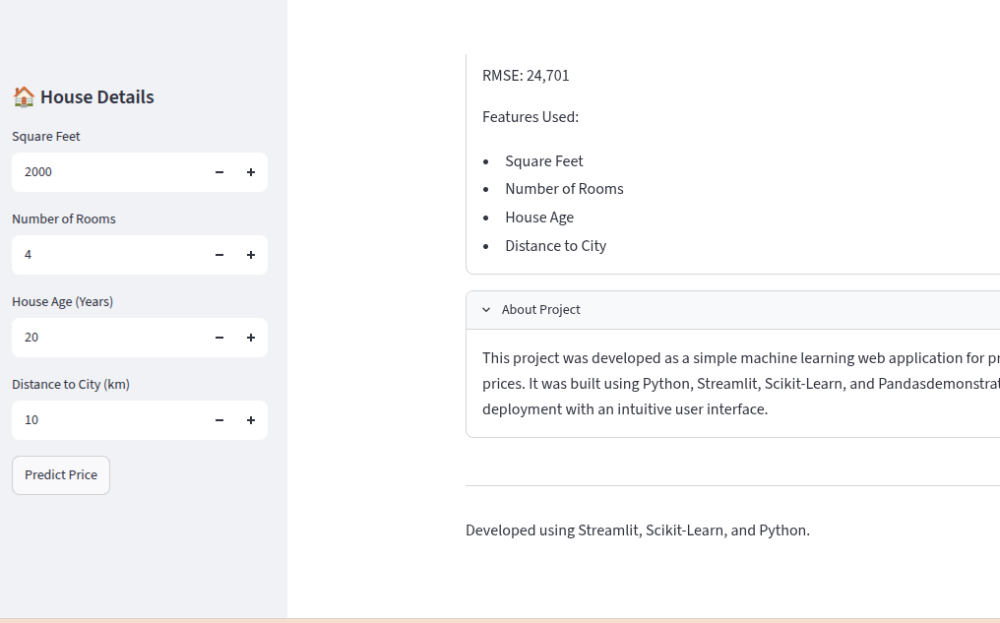

# 🏠 House Price Prediction

A machine learning web application that predicts house prices based on property features such as square footage, number of rooms, house age, and distance to the city.

The application is built with **Python**, **Scikit-Learn**, and **Streamlit**, and demonstrates how a trained machine learning model can be deployed as an interactive web application.

---

## 🚀 Features

- Predict house prices instantly
- Interactive Streamlit interface
- Linear Regression machine learning model
- Clean and user-friendly design
- Input validation using Streamlit widgets
- Model information included within the application

---

## 🛠️ Technologies Used

- Python
- Streamlit
- Scikit-Learn
- Pandas
- NumPy
- Joblib

---

## 📊 Dataset Information

The model was trained on a housing dataset containing approximately **10,000 records**.

### Features

| Feature | Description |
|----------|-------------|
| square_feet | Size of the house in square feet |
| num_rooms | Number of rooms |
| age | Age of the house (years) |
| distance_to_city(km) | Distance from the city (km) |

### Target

- **price**

Missing values were cleaned before training, and negative prices were replaced with the dataset's mean price.

---

## 🤖 Machine Learning Model

**Algorithm**

- Linear Regression

### Training Process

- Data cleaning
- Train-test split (80/20)
- Model training using Scikit-Learn
- Model saved using Joblib

---

## 📈 Model Performance

| Metric | Value |
|---------|-------|
| R² Score | **0.9351** |
| MAE | **16,543** |
| RMSE | **24,701** |

The model explains approximately **93.5%** of the variation in house prices on the test dataset.

---

## 📁 Project Structure

```text
House-Price-Prediction/
│
├── app.py
├── linear_regression_model.joblib
├── requirements.txt
├── README.md
├── .gitignore
├── assets/
├── notebooks/
└── screenshots/
```

---

## ⚙️ Installation

Clone the repository:

```bash
git clone https://github.com/digiusmans/House-Price-Prediction.git
```

Move into the project directory:

```bash
cd House-Price-Prediction
```

Install dependencies:

```bash
pip install -r requirements.txt
```

Run the application:

```bash
streamlit run app.py
```

---
## 🖥️ Application Preview

### 🏠 Home Page
The main interface where users can enter house details for price prediction.



---

### 💰 Prediction Result
Displays the estimated house price generated by the trained Linear Regression model.



---

### 📊 Model Information
Shows the machine learning algorithm, evaluation metrics, and the input features used by the model.



---

### ℹ️ About Project
Provides a brief overview of the project, technologies used, and its educational purpose.




---

## 🔮 Future Improvements

- Support additional machine learning algorithms
- Add data visualization
- Improve UI styling
- Add model comparison
- Deploy with Docker

---

## 👨‍💻 Author

**Usman Ali**

Assingmnet project 

---

## 📄 License

This project is licensed under the MIT License.